# VaultX

> **Status:** 🚧 VaultX is in heavy, fast-paced development. Features, APIs, and documentation are evolving; this README is a high-level snapshot until the dedicated GitBook site goes live.

<p align="center">
  <a href="https://github.com/vaultx-dev/vaultx/actions">
    
  </a>
  <a href="https://app.codecov.io/gh/vaultx-dev/vaultx">
    
  </a>
  <a href="#">
    
  </a>
  <a href="./LICENSE">
    
  </a>
  <a href="https://github.com/vaultx-dev/vaultx/issues">
    
  </a>
</p>

## Table of Contents
- [Executive Summary](#executive-summary)
- [Product Pillars](#product-pillars)
- [Visual Tour](#visual-tour)
- [Architecture Overview](#architecture-overview)
  - [Monorepo Surface](#monorepo-surface)
  - [Experience Layer (Next.js)](#experience-layer-nextjs)
  - [Service Layer (NestJS)](#service-layer-nestjs)
  - [Shared Capabilities](#shared-capabilities)
- [Delivery Methodology](#delivery-methodology)
- [Security & Compliance](#security--compliance)
- [Observability & Operability](#observability--operability)
- [Developer Experience](#developer-experience)
  - [Prerequisites](#prerequisites)
  - [Dev Container Workflow](#dev-container-workflow)
  - [Manual Setup](#manual-setup)
  - [Environment Variables](#environment-variables)
  - [Developer Command Suite](#developer-command-suite)
- [Getting Started](#getting-started)
  - [Boot the Stack](#boot-the-stack)
  - [Create Your First Secret](#create-your-first-secret)
  - [Call the Upcoming Secrets API](#call-the-upcoming-secrets-api)
- [Toolchain & Quality Controls](#toolchain--quality-controls)
- [CI/CD & Release Strategy](#cicd--release-strategy)
- [Deployment Guide](#deployment-guide)
  - [Local Sandbox](#local-sandbox)
  - [Minimum Server Requirements](#minimum-server-requirements)
  - [Production Considerations](#production-considerations)
- [Roadmap](#roadmap)
- [Documentation & Knowledge Base](#documentation--knowledge-base)
- [Security Disclosure](#security-disclosure)
- [Acknowledgments](#acknowledgments)
- [Contribution Guidelines](#contribution-guidelines)
- [License](#license)

## Executive Summary
VaultX is an open-source, zero-knowledge secrets management platform engineered for teams that need policy-aware, auditable distribution of credentials, files, and API tokens. The system balances a **user interface–first** delivery (to validate UX rapidly) with an **API-first** contract strategy (OpenAPI-driven), ensuring the Next.js front-end and NestJS back-end evolve as a single product.

Key outcomes:
- Hardened, policy-rich secret sharing (expiration, view limits, CIDR restrictions, one-time links).
- Enterprise-grade identity flows (MFA, OAuth/OIDC federation, JWT refresh tokens, session intelligence).
- Analytics-driven experience (dashboards, activity feeds, proactive security recommendations).
- Zero-knowledge encryption that prevents plaintext storage anywhere in the platform.

## Product Pillars
- **Security by design:** End-to-end envelope encryption, hardened auth flows, granular access policies.
- **Operational visibility:** Telemetry instrumentation, audit logging, Prometheus + Grafana ready.
- **Developer velocity:** Nx monorepo governance, feature-driven design, automated quality gates.
- **API-aligned UX:** Contract-first backlog keeps web experience and service APIs synchronized.
- **Scalable foundations:** Modular architecture prepared for future collaboration, integrations, and automation.

## Visual Tour
Even in alpha, the team documents the experience to guide early adopters and recruiters.

<p align="center">
  
</p>
<p align="center"><em>Operational dashboard summarizing secret activity, security posture, and recommendations.</em></p>

<p align="center">
  
</p>
<p align="center"><em>Secret composer showcasing policy controls, zero-knowledge encryption toggle, and audit visibility.</em></p>

Additional mockups, motion prototypes, and user journeys will ship with the GitBook release. Internal Figma files can be shared on request.

## Architecture Overview
VaultX runs as an Nx-managed monorepo where shared conventions, configuration, and tooling apply across products.

```mermaid
graph TD
  subgraph Client["Experience Layer — Next.js"]
    UI["App Router Views"]
    Features["Feature Slices\n(Auth, Secrets, Dashboard, API Mgmt, User Settings)"]
    State["Zustand Stores"]
    UI --> Features
    Features --> State
  end

  subgraph Shared["Shared Libraries"]
    Types["Domain Types & DTOs"]
    Crypto["Zero-Knowledge Envelope Crypto"]
    APIHelpers["API Response Helpers"]
  end

  subgraph API["Service Layer — NestJS"]
    Modules["Domain Modules\n(Auth, Vault, Sessions, Analytics, Integrations)"]
    Mongo[(MongoDB)]
    Redis[(Redis)]
    Telemetry[[OpenTelemetry Exporters]]
    Modules --> Mongo
    Modules --> Redis
    Modules --> Telemetry
  end

  subgraph Observability["Observability Stack"]
    Prometheus[(Prometheus Endpoint)]
    Grafana[Grafana Dashboards]
  end

  UI -->|HTTP / future GraphQL| Modules
  Features --> Shared
  Modules --> Shared
  Telemetry --> Prometheus --> Grafana
```



### Monorepo Surface
| Path | Purpose | Highlights |
|------|---------|------------|
| `apps/vaultx-web` | Next.js 15.5 application | App Router, shadcn/ui, Tailwind, Zustand stores, feature-driven slices. |
| `apps/vaultx-api` | NestJS 11 service | Config module, health checks, Mongo/Redis providers, Swagger bootstrap, telemetry exporters, seed scripts. |
| `libs/shared` | Cross-cutting toolkit | Domain types, API response envelopes, zero-knowledge crypto helpers, validations, seed payloads. |
| `docs/` | Contracts & internal guides | Includes OpenAPI spec and the evolving knowledge base that feeds GitBook. |

### Experience Layer (Next.js)
- Feature-driven directories (`src/features/auth`, `secrets`, `dashboard`, `api-management`, `user-settings`) provide modular components, hooks, and API adapters.
- Zustand stores persist authentication state via localStorage; adapters currently talk to mock services that mirror future API contracts.
- shadcn/ui + Radix primitives + Tailwind CSS compose the design system; shared utilities reside under `src/shared`.
- Jest (via `next/jest`) scaffolding is prepared; automated tests will activate alongside stable backend contracts.

### Service Layer (NestJS)
- Bootstrapped with global configuration, validation pipes, exception filters, and helmet/compression middleware.
- Infrastructure modules register MongoDB repositories (users, secrets, audit logs) and Redis clients for caching, session state, and queues.
- Swagger publishes the OpenAPI contract (`docs/api/openapi.yaml`) with JSON export support.
- Seed scripts leverage envelope encryption utilities to populate realistic demo data.
- Logging uses **pino** for structured JSON output with environment-aware verbosity.

### Shared Capabilities
- `libs/shared/src/types`: Canonical interfaces for secrets, users, tokens, metrics, audit events.
- `libs/shared/src/api.ts`: Standard success/error envelopes, pagination helpers, and error codes.
- `libs/shared/src/crypto/envelope.ts`: AES-GCM envelopes with PBKDF2 derivation—browser and Node compatible—for zero-knowledge storage.
- Shared validation schemas, seed payloads, and configuration helpers support both runtime surfaces.

## Delivery Methodology
- **UI-first**: Next.js experience leads discovery, backed by mocks that reflect production payloads to validate flows early.
- **API-first**: OpenAPI contracts authored upfront drive both Swagger docs and forthcoming client generation.
- **Feature-driven design**: Every domain feature ships as an isolated slice (components + hooks + data access) to keep UX coherent and maintainable.
- **Nx governance**: Enforces lint/format/test/build standards, module boundaries, and affected-graph intelligence for fast feedback loops.

## Security & Compliance
- Zero-knowledge secret handling: envelopes generated client-side before persistence.
- Strong authentication roadmap: password policy enforcement, 2FA enrollment, OAuth/OIDC with major IdPs, session revocation, suspicious activity alerts.
- Fine-grained policy enforcement: expirations, max view counts, one-time links, QR codes, IP allowlists.
- Defense-in-depth: Helmet, rate-limiting strategy via Redis, strict validation pipes, consistent exception translation.
- Auditability: Every secret access, session, and API token event is designed to emit structured logs for compliance review.

## Observability & Operability
- **OpenTelemetry** instrumentation covers HTTP servers, MongoDB, and Redis clients.
- The API exposes a Prometheus endpoint (default `:9464`) to feed Grafana dashboards and alerting pipelines.
- Health checks under `/v1/health` aggregate application, MongoDB, and Redis readiness.
- Structured logging via **pino** delivers JSON payloads compatible with ELK, Splunk, DataDog, or GCP Cloud Logging.
- Planned SLOs (latency, error budgets, token issuance) will be codified as the backend milestones land.

## Developer Experience

### Prerequisites
- Node.js 20.x (aligns with CI runner version).
- npm 10.x (bundled with Node 20).
- Docker Desktop (Dev Container dependencies: MongoDB, Redis).
- Optional: Nx CLI (`npm install -g nx`) for direct workspace commands.

### Dev Container Workflow
1. Open the repository in VS Code with Dev Containers (or use GitHub Codespaces).
2. The compose stack provisions:
   - `app`: development shell with Node toolchain.
   - `mongodb`: MongoDB 7 with persistent volumes.
   - `redis`: Redis 7 with append-only persistence.
3. Post-create hooks install npm dependencies; ports 4200 (web), 3000 (API), 27017 (MongoDB), 6379 (Redis), 9464 (Prometheus) are forwarded.

### Manual Setup
```bash
git clone https://github.com/<org>/vaultx.git
cd vaultx
npm install

# Optional: run infrastructure services
docker compose -f .devcontainer/docker-compose.yml up -d mongodb redis
cp .env .env.local  # adjust to your environment
```

### Environment Variables
| Variable | Purpose | Default |
|----------|---------|---------|
| `NODE_ENV` | Runtime mode. | `development` |
| `APP_PORT` / `APP_HOST` | NestJS listener configuration. | `3000` / `0.0.0.0` |
| `MONGO_URI` / `MONGO_DB_NAME` | MongoDB connection details. | `mongodb://mongodb:27017/vaultx` / `vaultx` |
| `REDIS_HOST` / `REDIS_PORT` | Redis cache/session store. | `redis` / `6379` |
| `CORS_ORIGINS` | Comma-separated allowed origins. | `http://localhost:3000,http://localhost:4200` |
| `SWAGGER_ENABLED` / `SWAGGER_PATH` | Swagger UI exposure. | `true` / `docs` |
| `OTEL_ENABLED` / `OTEL_PROM_PORT` | Telemetry export controls. | `true` / `9464` |

### Developer Command Suite
| Command | Description |
|---------|-------------|
| `npm run dev:web` | Start the Next.js dashboard (port 4200). |
| `npm run dev:api` | Launch the NestJS API (port 3000). |
| `npm run build:web` / `npm run build:api` | Production builds for each surface. |
| `npm run build:all` | Nx run-many build across the workspace. |
| `npm run lint:all` / `npm run lint:fix` | Project-wide ESLint validation (with optional autofix). |
| `npm run format:check` / `npm run format` | Prettier verification and formatting (80 chars, single quotes). |
| `npm run test:all` | Execute Nx-managed Jest suites (currently scaffolded). |
| `npm run quality` | Opinionated pre-PR guard: lint → format → tests. |
| `npm run seed:api` | Seed MongoDB with demo users/secrets using encrypted envelopes. |

## Getting Started

### Boot the Stack
1. **Install dependencies**
   ```bash
   npm install
   ```
2. **Launch support services (optional outside Dev Container)**
   ```bash
   docker compose -f .devcontainer/docker-compose.yml up -d mongodb redis
   ```
3. **Run the front-end**
   ```bash
   npm run dev:web
   ```
4. **Run the API skeleton** (prints readiness, seeds configuration, and exposes health checks)
   ```bash
   npm run dev:api
   ```
5. Visit `http://localhost:4200` to explore the UI-first experience with live mock data.

### Create Your First Secret
Until Milestone 2 lands, the web client simulates persistence through mocks so you can demo the UX:
1. Sign in with any email/password combination—the mock auth store will accept it.
2. Navigate to **Secrets → Create Secret**.
3. Provide sample content, apply an expiration window, enable one-time link and view limits.
4. Toggle “Encrypt secret client-side” to see the zero-knowledge envelope flow in action.
5. Save to inject the secret into the mock dataset and observe audit analytics update in real time.

### Call the Upcoming Secrets API
The NestJS service is contract-first. Once Milestone 2 ships, the following request (per `docs/api/openapi.yaml`) will create a secret end-to-end:

```bash
curl -X POST http://localhost:3000/v1/secrets \
  -H "Content-Type: application/json" \
  -H "Authorization: Bearer <access-token>" \
  -d '{
    "title": "Production API key",
    "content": "sk_live_51H7...",
    "expiresAt": "2026-01-15T00:00:00.000Z",
    "maxViews": 3,
    "allowedIPs": ["203.0.113.0/24"],
    "tags": ["production", "payments"],
    "envelope": {
      "version": "v1",
      "ciphertext": "<client-encrypted>",
      "iv": "<client-generated>",
      "salt": "<client-generated>"
    }
  }'
```

Token issuance (OAuth/OIDC + password flows) will be available once the Identity & Sessions milestone unlocks. The curl example is included here so recruiters can see the intended developer ergonomics.

## Toolchain & Quality Controls
- **Nx Monorepo:** Enforces project graph boundaries and orchestrates lint/test/build pipelines.
- **Prettier:** Workspace-wide formatting enforced locally, via Husky, and in CI.
- **ESLint:** TypeScript, React, accessibility, and security rule sets keep the codebase consistent.
- **commitlint + Conventional Commits:** Standardized commit messages (`npm run commit` wizard available).
- **Husky + lint-staged:** Pre-commit automation for linting, formatting, and legal headers.
- **Swagger / OpenAPI:** Contract-first development via `docs/api/openapi.yaml`, published by NestJS.
- **OpenTelemetry → Prometheus → Grafana:** Telemetry pipeline for metrics and tracing.
- **Pino logging:** Structured JSON logs aligned with enterprise observability platforms.
- **SonarCloud:** Static analysis for maintainability, reliability, and security hotspots.
- **npm audit:** High-severity dependency scanning integrated into CI.

## CI/CD & Release Strategy

### Development (feature/* → develop)
Pull requests into `develop` (and direct pushes to `feature/*` or `develop`) trigger `ci-validation.yml` with stages for format, lint, type check, tests, security audit, SonarCloud analysis, and Nx affected builds.

### Release (release/* → staging) — planned
Upcoming `ci-release.yml` will extend development checks with Playwright E2E suites, Docker multi-stage builds, Docker Scout scanning, and automated deployment to a staging cluster via Portainer. Release branches will be the gatekeeper for QA sign-off prior to merging into `main`.

### Production (main) — planned
`ci-production.yml` will activate Semantic Release for versioning/changelogs, retag Docker images from release artifacts, and orchestrate monitored deployments to production (Portainer-managed). Observability hooks and SLO validation will run as part of the rollout.

### Hotfix (hotfix/*) — planned
`ci-hotfix.yml` will streamline regression testing, security scanning, and targeted Docker builds for emergency fixes, then back-merge results into `develop` and active release branches.

All future workflows align with the DevOps playbook and will go live alongside Milestone 1.


## Deployment Guide

### Local Sandbox
- **One-command bootstrap:** `docker compose -f .devcontainer/docker-compose.yml up -d` provisions MongoDB and Redis with persisted volumes.
- **App runtime:** Use `npm run dev:web` and `npm run dev:api` for watch-mode development, or `npm run build:all` followed by `npm run start -- --project` (via Nx) for production builds.
- **Seed data:** Execute `npm run seed:api` after the API server is available to populate demo users, secrets, and envelopes.

### Minimum Server Requirements
- **CPU & Memory:** 2 vCPU / 4 GB RAM for a single-node sandbox; 4 vCPU / 8 GB RAM recommended for staging.
- **Storage:** 20 GB persistent SSD for MongoDB, 5 GB for Redis AOF logs, plus 5 GB for application logs/artifacts.
- **Networking:** Ability to expose ports 3000 (API), 4200 (web if SSR hosted separately), and 9464 (Prometheus) behind TLS termination.
- **Runtime:** Node.js 20 LTS, Docker Engine 24+, MongoDB 7+, Redis 7+.

### Production Considerations
- **Secrets management:** Store environment variables (JWT secrets, encryption keys, OAuth credentials) in a managed vault such as HashiCorp Vault or AWS Secrets Manager.
- **TLS & MFA enforcement:** Terminate TLS at an ingress controller or service mesh; enforce SSO or MFA policies according to FR-01/FR-06 guidelines.
- **Observability:** Ship OpenTelemetry exports to Prometheus, visualise in Grafana, and forward pino JSON logs to your logging stack.
- **Backups & DR:** Schedule MongoDB and Redis snapshots; ensure envelope keys are rotated and escrowed securely.
- **Scaling:** Front web app via edge CDN; scale the NestJS API horizontally once stateful modules (sessions, rate limiting) are backed by Redis.
- **Compliance:** Align with SOC2/GDPR by enabling audit trails (FR-03) and data export/delete flows (FR-08) prior to production launch.

## Roadmap
The Software Requirements Specification (SRS) outlines nine functional requirements (FR-01…FR-09). Delivery is staged across milestones to merge the UI-first prototype with the API-first services:

| Milestone | Focus | SRS Alignment | Highlights |
|-----------|-------|---------------|------------|
| **0. Platform Foundation** (ongoing) | Harden NestJS core, Mongo/Redis infrastructure, zero-knowledge crypto, telemetry endpoints. | Supports every FR plus NFR-01 performance targets. | Configuration, health checks, telemetry, and logging scaffolding largely complete. |
| **1. Identity & Sessions** | Authentication and session intelligence. | FR-01 (Authentication), FR-05 (Session Management). | OAuth/OIDC federation, JWT rotation, 2FA initiation, session listings, anomaly alerts. |
| **2. Secrets Vault** | Secure vault functionality. | FR-02 (Secrets CRUD), FR-03 (Secret Security Configuration). | CRUD APIs, template library, expiration policies, IP allowlists, audit trail, envelope storage. |
| **3. Insights & UX** | Experience analytics and discovery. | FR-04 (Dashboard & Analytics), FR-09 (Search & Filtering). | Live metrics, exportable reports, WebSocket updates, advanced search with autocomplete/debounce. |
| **4. Account Hardening** | User and security preferences. | FR-06 (Security Settings), FR-08 (User Settings). | 2FA enrollment, security notifications, data export/delete, localization groundwork. |
| **5. Integrations & APIs** | External integrations and DevOps automation. | FR-07 (API Management) + pipeline initiatives. | Token lifecycle with RBAC, rate limiting, webhooks, client SDKs, release/production/hotfix workflows. |

Each milestone inherits the non-functional benchmarks enumerated in the SRS (latency, concurrency, bundle budgets) and feeds directly into the GitBook documentation rollout.


## Documentation & Knowledge Base
- **Living knowledge base:** Requirements (SRS), architecture handbook, DevOps playbook, and PM backlog are being consolidated for publication.
- **GitBook migration:** Comprehensive, recruiter-ready documentation is under construction and will be published to the VaultX GitBook workspace once stabilized.
- **API reference:** `docs/api/openapi.yaml` (and the Swagger endpoint) provide the source of truth for request/response contracts.
- **Component references:** Feature-level docs reside under `apps/vaultx-web/docs` until the GitBook migration is complete.

## Security Disclosure
eline within 10 business days.
- **Research guidelines:** Please avoid tests that could compromise real user data or degrade service availability. Coordinate before running large-scale scans or fuzzing.
- **Public disclosure:** Do not publish vulnerabilities until a coordinated release has been executed or you have received explicit permission.

## Acknowledgments
- **Next.js 15** — progressive web app framework powering the experience layer.
- **NestJS 11** — modular Node.js framework enabling contract-first service delivery.
- **Nx** — monorepo orchestration for consistent tooling, linting, and build pipelines.
- **shadcn/ui + Radix UI + Tailwind CSS** — design system foundations for accessible UI.
- **Zustand** — lightweight store enabling UI-first prototyping with persistence.
- **MongoDB & Redis** — primary persistence and caching layers.
- **OpenTelemetry, Prometheus, Grafana** — observability stack for metrics and tracing.
- **Pino** — structured logging tuned for modern log pipelines.

## Contribution Guidelines
- Synchronize with the FR backlog or open a GitHub issue before starting work.
- Branch from `develop` using `feature/<description>` or the FR-prefixed convention (e.g., `feature/fr-02-secrets`).
- Run `npm run quality` (lint → format → tests) and address all findings before opening a pull request.
- Use `npm run commit` to generate Conventional Commit messages; commitlint will reject non-compliant messages.
- Keep the knowledge base in sync: update SRS/architecture/DevOps notes whenever new capabilities or pipelines land.

## License
VaultX is distributed under the **Creative Commons Attribution-NonCommercial-ShareAlike 4.0 International License** (`LICENSE`). Commercial usage requires explicit permission from the maintainers.
